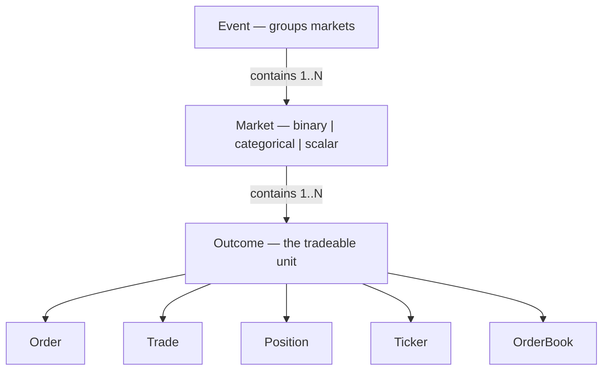

# Proposal: unified types for the `ccxt.prediction` namespace

## Summary

A three-level hierarchy — **Event → Market → Outcome** — where the **Outcome** is the tradeable unit, and `Order` / `Trade` / `Position` / `Ticker` / `OrderBook` all reference it by its `outcome` handle.

These are **dedicated** structures, not the spot/derivatives `Order`/`Trade`/`Position` — prediction markets have a different shape (you buy an outcome at a probability, there's no base/quote pair). Key decisions:

- **No `symbol` field.** The handle is `outcome` (`"MARKET:LABEL"`, e.g. `TRUMP_WIN_2024:YES`) and the raw exchange id is `outcomeId`.
- **Prices are probabilities (0–1)**, amounts are **shares**, costs are **collateral** — native units (cents, 1e18 wei, 6-dp) are normalized in the parser.
- **`side` is just `buy`/`sell`.** YES/NO lives inside the outcome handle.
- **A `Market` is 1..N outcomes** tagged `binary | categorical | scalar`, covering Yes/No, multi-candidate, and range markets.

Every field below is mapped to what **polymarket, kalshi, limitless, myriad, hyperliquid** actually return in their official API docs / SDKs.

## How the structures relate



*Order/Trade/Position/Ticker/OrderBook each reference an Outcome via its `outcome` handle.*

## Conventions

- `price` / `bid` / `ask` / `last` = **probability 0–1**
- `amount` / `contracts` = **shares**; `cost` / `notional` / `payout` = **collateral** (quote currency)
- `side` = `'buy' | 'sell'` of an outcome
- **Identity:** `outcome` = handle (round-trips into every method; `exchange.outcomes` key) · `outcomeId` = raw exchange/on-chain id (stable, internal) · `label` = "Yes"/"Trump" · `market` / `event` = parents

---

## Reference structures

### Event

```ts
interface PredictionEvent {
    info: any;
    id: string;                 // raw exchange event id
    event: string;              // unified handle "US_ELECTION_2024"
    title?: Str; description?: Str; slug?: Str;
    category?: Str; tags?: string[];
    markets: PredictionMarket[];        // grouped markets (does not re-derive outcomes)
    mutuallyExclusive?: Bool;           // exactly one market in the event resolves YES
    active?: Bool; resolved?: Bool;
    volume?: Num; liquidity?: Num;
    created?: Int; createdDatetime?: Str;
    end?: Int; endDatetime?: Str;
    image?: Str; url?: Str;
}
```

| field | polymarket | kalshi | limitless | myriad | hyperliquid |
|---|---|---|---|---|---|
| id / event | event `id` / `slug` | `event_ticker` | group `id` / `negRiskMarketId` | question `id` / `eventId` | `question` |
| title | event `title` | `title` + `sub_title` | group `title` | question `title` | question `name` |
| markets[] | event `markets[]` | event `markets[]` (nested) | group `markets[]` | question `markets[]` | `namedOutcomes` |
| mutuallyExclusive | `negRisk` | `mutually_exclusive` | negRisk group | `negRisk` | (question: one YES) |
| category / tags | `category` / `tags[]` | series `category` / `tags` | `categories` / `tags` | market `topics` | — |
| end | `endDate` | `strike_date` | — | `expiresAt` | `expiry` |

### Market

```ts
interface PredictionMarket {
    info: any;
    id: string;                          // raw exchange market id
    market: string;                      // unified handle "TRUMP_WIN_2024"
    event?: Str;
    marketType: 'binary' | 'categorical' | 'scalar';
    executionModel?: 'clob' | 'amm' | 'parimutuel';   // AMM/parimutuel have no resting book
    title?: Str; description?: Str;
    outcomes: PredictionOutcome[];       // 1..N
    underlying?: Str; floorStrike?: Num; capStrike?: Num; strikeType?: Str;   // scalar only
    collateral?: Str;                    // quote currency symbol
    active?: Bool; closed?: Bool; resolved?: Bool;
    resolvedOutcome?: Str;               // winning outcome handle
    settlementValue?: Num;               // scalar: the realized number (e.g. CPI = 2.7)
    created?: Int; createdDatetime?: Str;
    end?: Int; endDatetime?: Str;
    volume?: Num; liquidity?: Num; openInterest?: Num;
    tickSize?: Num;
    limits?: { amount?: MinMax; cost?: MinMax };
    fees?: { trading?: Num; resolution?: Num };
    resolutionSource?: Str; image?: Str;
}
```

| field | polymarket | kalshi | limitless | myriad | hyperliquid |
|---|---|---|---|---|---|
| id / market | `conditionId` / `slug` | `ticker` | `conditionId` / `slug` | `id` (+`networkId`) / `slug` | `question` |
| marketType | binary / categorical (N-way arrays) | **binary / scalar** (`market_type`) | binary (group = categorical) | binary (OB) / N-way (AMM) | binary (priceBucket = categorical) |
| executionModel | clob | clob | `tradeType` clob/amm | `tradingModel` ob/amm | clob |
| scalar strikes | — | `floor_strike`/`cap_strike`/`strike_type` | — | — | desc `targetPrice` |
| outcomes[] | `outcomes`/`clobTokenIds` arrays | implicit YES/NO | `tokens{yes,no}` + `prices` | `outcomes[]` | `sideSpecs[]` |
| resolved / resolvedOutcome | `closed` + resolution | `result` | `winningOutcomeIndex` | `resolvedOutcomeId` | `settleFraction` |
| volume (quote) | `volume` / `volume24hr` | `volume_fp` (contracts) | `volume` / `volumeFormatted` | `volumeNotional` / `…24h` | `dayNtlVlm` |
| openInterest | — | `open_interest_fp` | `openInterest` | — | `openInterest` |
| end (expiry) | `endDate` | `close_time` / `expiration_time` | `expirationTimestamp` | `expiresAt` / `resolvesAt` | `expiry` (desc) |
| tickSize / limits | `orderPriceMinTickSize` / `orderMinSize` | `PriceRange.step` | `settings.minSize` | 1 wei | — |
| fees.resolution | 2% net winnings (Intl) | — | — | — | — |
| collateral | USDC | USD | `collateralToken.symbol` | `token.symbol` | USDC |

### Outcome

```ts
interface PredictionOutcome {
    info: any;
    outcome: string;        // handle "TRUMP_WIN_2024:YES" — round-trips; ex.outcomes key
    outcomeId?: Str;        // raw exchange/on-chain id (token id / ticker / coin)
    label?: Str;            // short human name "Yes"
    market?: Str; marketId?: Str; event?: Str;
    price?: Num;            // probability 0-1
    bid?: Num; ask?: Num;
    active?: Bool;
    winner?: Bool;          // resolved true (the settleFraction === 1 case)
    settleFraction?: Num;   // 0-1 fractional settlement
}
```

| field | polymarket | kalshi | limitless | myriad | hyperliquid |
|---|---|---|---|---|---|
| first-class? | yes (`tokens[]`) | no (implicit YES/NO) | no (implicit) | yes (`outcomes[]`) | semi (`outcomeMeta`) |
| outcomeId (raw) | `tokens[].token_id` | `ticker` (+`-NO`) | `tokens.{yes,no}` | outcome `tokenId` | `coin` `#enc` |
| label | `tokens[].outcome` | `yes/no_sub_title` | `outcomeTokens[i]` | outcome `title` | `sideSpecs[].name` |
| price (0–1) | `tokens[].price` | derived bid/ask | `prices[i]` (÷100) | outcome `price` | `markPx` |
| bid / ask | book | `yes/no_bid_dollars` / ask | orderbook | `bestBid` / `bestAsk` | l2 levels |
| winner / settleFraction | `tokens[].winner` | `result` | `winningOutcomeIndex` | `resolvedOutcomeId` | `settleFraction` |

---

## Trading structures

### Order

```ts
interface PredictionOrder {
    info: any;
    id: string; clientOrderId?: Str;
    timestamp: Int; datetime: Str;
    status: 'open' | 'closed' | 'canceled' | 'expired' | Str;
    outcome: string; outcomeId?: Str; label?: Str; market?: Str; event?: Str;
    side: 'buy' | 'sell';
    type?: Str; timeInForce?: Str;
    price: Num;      // probability 0-1
    amount: Num;     // shares
    filled: Num; remaining: Num; average?: Num;
    cost: Num;       // collateral
    currency?: Str;  // collateral currency
    fee?: Fee;
    trades?: PredictionTrade[];
}
```

| field | polymarket | kalshi | limitless | myriad | hyperliquid |
|---|---|---|---|---|---|
| id | `id` / `orderID` | `order_id` | `id` | `orderHash` | `oid` |
| status | `status` | `status` | `status` + `settlementStatus` | `status` (+`filledAmount`) | `status` |
| side | `side` | `outcome_side` + `book_side` | `side` 0\|1 | inner `side` 0\|1 | `side` B/A |
| price (0–1) | `price` | `yes_price_dollars` | `price` | inner `price` ÷1e18 | `limitPx` |
| amount (shares) | `original_size` ÷1e6 | `initial_count_fp` | `makerAmount`/`takerAmount` ÷1e6 | inner `amount` ÷1e18 | `origSz` |
| cost / currency | calc / USDC | `*_fill_cost_dollars` / USD | `usdGross` / `collateralToken.symbol` | calc / `token.symbol` | calc / USDC |
| fee | `fee_rate_bps` | `*_fees_dollars` | `feeRateBps` / `usdFee` | — | `fee` + `feeToken` |

### Trade

```ts
interface PredictionTrade {
    info: any; id: Str; order?: Str;
    timestamp: Int; datetime: Str;
    outcome: string; outcomeId?: Str; label?: Str; market?: Str;
    side: 'buy' | 'sell';
    takerOrMaker?: 'taker' | 'maker' | Str;
    price: Num; amount: Num; cost: Num;
    currency?: Str;
    fee?: Fee;
    realizedPnl?: Num;
}
```

| field | polymarket | kalshi | limitless | myriad | hyperliquid |
|---|---|---|---|---|---|
| id | `transaction_hash` | `fill_id` / `trade_id` | `transactionHash` | `txId` | `tid` |
| price (0–1) | `price` | `yes_price_dollars` | `outcomeTokenPrice` | value/shares | `px` |
| amount (shares) | `size` ÷1e6 | `count_fp` | `outcomeTokenAmount` ÷1e6 | `shares` | `sz` |
| cost / currency | calc / USDC | calc / USD | `collateralAmount` ÷1e6 | `value` | calc / USDC |
| takerOrMaker | `trader_side` | `is_taker` | match role | taker/makers | `crossed` |
| realizedPnl | — | — | — | — | `closedPnl` |

### Position

```ts
interface PredictionPosition {
    info: any; id?: Str;
    outcome: string; outcomeId?: Str; label?: Str; market?: Str; event?: Str;
    oppositeOutcome?: Str;   // complementary leg (NO when you hold YES)
    timestamp?: Int; datetime?: Str;
    side: 'long';
    contracts: Num;          // shares held
    entryPrice?: Num; markPrice?: Num;
    notional?: Num; cost?: Num;
    currency?: Str;          // collateral currency (for cross-market P&L)
    unrealizedPnl?: Num; realizedPnl?: Num; percentage?: Num;
    resolved?: Bool; won?: Bool; settleFraction?: Num; payout?: Num;
}
```

| field | polymarket | kalshi | limitless | myriad | hyperliquid |
|---|---|---|---|---|---|
| contracts (shares) | `size` | `position_fp` (signed) | `tokensBalance.{yes,no}` ÷1e6 | `shares` | `total` |
| entryPrice (0–1) | `avgPrice` | — | `positions.*.fillPrice` ÷1e6 | `price` | `entryNtl`/`total` |
| markPrice (0–1) | `curPrice` | — | `latestTrade.latest{Yes,No}Price` | outcome `price` | `markPx` |
| notional / cost | `currentValue` / `initialValue` | `market_exposure_dollars` / `total_traded_dollars` | `marketValue` / `cost` ÷1e6 | `value` | `entryNtl` |
| currency | USDC | USD | `collateralToken.symbol` | `token.symbol` | USDC |
| unrealizedPnl / realizedPnl | `cashPnl` / `realizedPnl` | — / `realized_pnl_dollars` | `unrealizedPnl` / `realisedPnl` | `profit` / — | — / — |
| percentage (ROI) | `percentPnl` | — | — | `roi`×100 | — |
| oppositeOutcome | `oppositeAsset` | (the −NO ticker) | other token | other outcomeId | other side coin |
| resolution (won / payout) | `redeemable` + `realizedPnl` | `result` | `winningOutcomeIndex` | `winningsToClaim` / `status` | `settleFraction` |

### Ticker

```ts
interface PredictionTicker {
    info: any;
    outcome: string; outcomeId?: Str; label?: Str; market?: Str; event?: Str;
    timestamp: Int; datetime: Str;
    bid?: Num; bidVolume?: Num; ask?: Num; askVolume?: Num;
    last?: Num; close?: Num; average?: Num;
    previousClose?: Num; change?: Num; percentage?: Num;
    baseVolume?: Num; quoteVolume?: Num;
    openInterest?: Num;
}
```

| field | polymarket | kalshi | limitless | myriad | hyperliquid |
|---|---|---|---|---|---|
| bid / ask (0–1) | `book.bids/asks[0].price` | `yes/no_bid_dollars` / ask | `prices[i]` | `bestBid` / `bestAsk` | `levels[0]/[1][0].px` |
| last (0–1) | `last_trade_price` | `last_price_dollars` | `prices[i]` | outcome `price` | `markPx` / `midPx` |
| previousClose | — | `previous_price_dollars` | — | — | `prevDayPx` |
| baseVolume / quoteVolume | — / `volume24hr` | `volume_fp` / — | — / `volumeFormatted` | `volume24h` / `volumeNotional24h` | `dayBaseVlm` / `dayNtlVlm` |
| openInterest | — | `open_interest_fp` | `openInterest` | — | `openInterest` |

### OrderBook

```ts
interface PredictionOrderBook {
    outcome: string;     // required — books are per-outcome
    outcomeId?: Str; market?: Str;
    bids: [Num, Num][];  // [probability 0-1, shares]
    asks: [Num, Num][];
    timestamp: Int; datetime: Str;
    nonce?: Int;
}
```

A real order book is a CLOB concept. polymarket `book.bids/asks` (per token); kalshi `orderbook_fp` is dual-sided (`yes_dollars` + `no_dollars`), bids-only — each side's asks are the opposite side's bids inverted (ask = 1 − bid); hyperliquid `levels[0]/[1]`; limitless / myriad CLOB markets. On **AMM/parimutuel** venues there is no resting book — those expose price via `Ticker`, and a depth/quote primitive is a later-phase addition (see roadmap). `fetchOrderBook` stays CLOB-only.

---

## Per-exchange units & normalization

- **polymarket** — two APIs: CLOB (snake_case, sizes 6-dp strings) and Data-API (camelCase, plain numbers); prices already 0–1. Gamma `outcomes`/`outcomePrices`/`clobTokenIds` are JSON-string arrays; `conditionId` joins the APIs. `GET /price` documents its side→bid/ask mapping inverted — verify live.
- **kalshi** — read `*_dollars` (0–1) / `*_fp` (contracts), fall back to legacy int-cents (÷100). `market_type` is binary or scalar. Orderbook dual-sided, bids-only. Multi-candidate = event of binary markets.
- **limitless** — USDC + share amounts scaled by 1e6; orderbook prices 0–1, but market-list `prices` may be 0–100 — verify. `realisedPnl` (CLOB) vs `realizedPnl` (AMM).
- **myriad** — order-book path uses 1e18-scaled strings (price = 0–1 ×1e18, amount = shares ×1e18); AMM/portfolio/market REST are human decimals with 0–1 prices. Branch on `executionMode` / `tradingModel`.
- **hyperliquid** — HIP-4 prediction markets ride the spot path: side A/B, position = spot balance (no leverage), `markPx` ≈ probability, coin `#<encoding>` (`encoding = 10·outcome + side`), fractional `settleFraction`.

## Decisions & roadmap

**Settled**

- **Scalar markets stay in the unified `Market`** — same trading surface as binary; `marketType:'scalar'` + `floorStrike`/`capStrike`/`strikeType` describe the payout curve, `settlementValue` carries the realized number, and the outcome's `settleFraction` gives the 0–1 payout. Consistent with how CCXT already folds options into `Market`; no separate type.

**Phase 2 — the structure already grows into it, no breaking change**

- **AMM / parimutuel.** Few venues/methods need it today, so it's deferred. CLOB is the phase-1 focus and `fetchOrderBook` is CLOB-only (a pool has no resting book). The `executionModel` discriminator (`clob`/`amm`/`parimutuel`) is already on `Market`, so phase 2 can add a `fetchQuote(outcome, side, amount|cost)` method returning a small `PredictionQuote` (avg price + price impact) without changing any existing structure.

**Open**

- **Order-by-cost.** Prediction users think in collateral ("bet $10"), not shares — `createOrder(outcome,'buy',10,0.62)` spends $6.20, not $10. Add a `createOrderByCost` / `params.cost` path, or at least document the unit loudly?

## Sources

- **polymarket**: [Gamma overview](https://docs.polymarket.com/developers/gamma-markets-api/overview), [events](https://docs.polymarket.com/api-reference/events/list-events), [markets](https://docs.polymarket.com/api-reference/markets/list-markets), [orders](https://docs.polymarket.com/api-reference/trade/get-user-orders), [trades](https://docs.polymarket.com/api-reference/trade/get-trades), [positions](https://docs.polymarket.com/api-reference/core/get-current-positions-for-a-user), [book](https://docs.polymarket.com/api-reference/market-data/get-order-book)
- **kalshi**: [market](https://docs.kalshi.com/api-reference/market/get-market), [event](https://docs.kalshi.com/api-reference/events/get-event), [series](https://docs.kalshi.com/api-reference/market/get-series), [orders](https://docs.kalshi.com/api-reference/orders/get-orders), [fills](https://docs.kalshi.com/api-reference/portfolio/get-fills), [positions](https://docs.kalshi.com/api-reference/portfolio/get-positions), [orderbook](https://docs.kalshi.com/api-reference/market/get-market-orderbook)
- **limitless**: [docs](https://docs.limitless.exchange/) · SDK [limitless-exchange-ts-sdk](https://github.com/limitless-labs-group/limitless-exchange-ts-sdk)
- **myriad**: [API reference](https://docs.myriad.markets/builders/myriad-api-reference), [order-book API](https://docs.myriad.markets/builders/myriad-order-book/order-book-api), [JS SDK](https://docs.myriad.markets/builders/javascript-sdk)
- **hyperliquid**: [info endpoint](https://hyperliquid.gitbook.io/hyperliquid-docs/for-developers/api/info-endpoint), [asset IDs](https://hyperliquid.gitbook.io/hyperliquid-docs/for-developers/api/asset-ids), [HIP-4](https://hyperliquid.gitbook.io/hyperliquid-docs/hyperliquid-improvement-proposals-hips/hip-4-outcome-markets)
