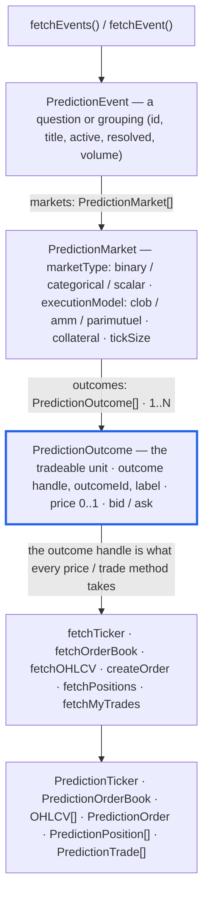

# Prediction Markets

CCXT supports prediction-market exchanges (Polymarket, Kalshi, Limitless, Myriad, and Hyperliquid prediction markets) through a dedicated `prediction` namespace. Prediction exchanges implement the same unified API as regular crypto exchanges, with prices quoted between 0 and 1 USDC per outcome share.

> Per-exchange API references live in the **[Prediction Markets](/docs/prediction)** section, and runnable code is under **[Examples](/docs/examples)**.

```javascript
// JavaScript / TypeScript
const exchange = new ccxt.prediction.polymarket ()
```

```python
# Python (async-only — ccxt.prediction.<id> IS the async class)
import ccxt.prediction
exchange = ccxt.prediction.polymarket()
```

```php
// PHP (async-only, ReactPHP — \ccxt\prediction\<id> IS the async class)
$exchange = new \ccxt\prediction\polymarket();
```

```csharp
// C#
var exchange = new ccxt.prediction.polymarket();
```

```go
// Go
import ccxtprediction "github.com/ccxt/ccxt/go/v4/prediction"
exchange := ccxtprediction.NewPolymarket()
```

```java
// Java
import io.github.ccxt.exchanges.prediction.Polymarket;
Polymarket exchange = new Polymarket();
```

Prediction exchanges are flagged with `exchange.has['prediction']`. Their data model has three levels:

- **events** — a question or grouping, like *"Will X happen by July?"*
- **markets** — each event contains one or more markets, returned by `fetchMarkets()` / `loadMarkets()` with `market['type'] === 'prediction'`
- **outcomes** — each market carries an `outcomes` list (for example YES and NO tokens); each outcome has its own `outcome` handle like `TRUMP_OUT_PRESIDENT_2027:YES`, an exchange-specific `outcomeId`, the parent `market`, and a `label` (e.g. `YES`/`NO`)

How the structures relate — `PredictionEvent` → `PredictionMarket` → `PredictionOutcome`, where the **outcome** is the tradeable unit that every price/trade method takes:



Prices are probabilities between 0 and 1 per share, `amount` is the number of shares, and `cost` is the collateral spent.

## Unified methods

Prediction exchanges expose the same unified API as crypto exchanges. Discovery starts with events; every **price and trade** method then takes an **outcome handle** (or outcome id) through the `outcome` / `outcomes` parameter instead of a market symbol. Support varies per venue — always check `exchange.has[methodName]` and the [per-exchange reference](/docs/prediction/polymarket).

**Discovery & markets**

- `fetchEvents (queries?, params?)` — search or list events, caching their markets and outcomes
- `fetchEvent (id, params?)` — a single event by id, slug or ticker
- `fetchMarkets (params?)` / `loadMarkets (reload?)` — every market (each carries `type: 'prediction'` and an `outcomes` list)
- `fetchTime (params?)` — exchange server time

**Market data** — each takes an outcome handle

- `fetchTicker (outcome, params?)` / `fetchTickers (outcomes?, params?)` — last price, bid/ask and volume
- `fetchOrderBook (outcome, limit?, params?)` — bids and asks for an outcome
- `fetchOHLCV (outcome, timeframe?, since?, limit?, params?)` — price-history candles
- `fetchTrades (outcome, since?, limit?, params?)` — public trades
- `fetchOpenInterest (outcome, params?)` — open interest
- `fetchTradingFee (outcome, params?)` — taker / maker fees
- `fetchTradeQuote (outcome, ...)` — an executable quote on AMM venues

**Trading** — `amount` is the number of shares, `price` is a probability between 0 and 1

- `createOrder (outcome, type, side, amount, price?, params?)` — place an order
- `createOrders (orders, params?)` — batch create
- `editOrder (id, outcome, ...)` — amend a resting order
- `cancelOrder (id, outcome?, params?)`, `cancelOrders (ids, ...)`, `cancelAllOrders (outcome?, params?)`

**Account & orders**

- `fetchBalance (params?)` — collateral balances
- `fetchOrder (id, outcome?, params?)`, `fetchOrders`, `fetchOpenOrders`, `fetchClosedOrders`, `fetchCanceledOrders`, `fetchOrderTrades`
- `fetchMyTrades (outcome?, since?, limit?, params?)` — your fills
- `fetchPositions (outcomes?, params?)` / `fetchPosition (outcome, params?)` — open positions
- `fetchStatus (params?)` — exchange operational status

**WebSocket (Pro)** — live streams, also keyed by the outcome handle

- `watchTicker`, `watchTickers`, `watchOrderBook`, `watchTrades`, `watchOHLCV`, `watchOrders`, `watchMyTrades`, `watchPositions`

The rest of this page documents `fetchEvents` and `fetchEvent`, the two entry points unique to prediction markets; the remaining methods behave like their crypto counterparts in [the Manual](/docs/manual), only addressed by outcome.

## fetchEvents

```javascript
fetchEvents (queries = undefined, params = {})
```

- `queries` — an optional array of free-text search terms; when omitted, the active events listing is fetched
- returns an **array of event structures** and caches the discovered markets and outcomes on the instance (`exchange.events`, `exchange.outcomes`)

```javascript
// event structure
{
    'id': '903193',                       // exchange-specific event id
    'slug': 'will-x-happen-by-july',      // url slug of the event
    'symbol': 'WILL_X_HAPPEN_JULY',       // shortened unified event key
    'title': 'Will X happen by July?',    // human-readable title
    'markets': [ ... ],                   // a list of market structures, each with an outcomes list
    'active': true,                       // whether the event is still tradable
    'resolved': false,                    // whether the event has been resolved
    'end': 1781234567890,                 // resolution deadline timestamp in ms
    'endDatetime': '2026-07-01T00:00:00Z',
    'info': { ... },                      // the raw exchange response
}
```

A typical workflow:

```javascript
const exchange = new ccxt.prediction.polymarket ()
const events = await exchange.fetchEvents ([ 'Trump' ])
const outcome = events[0]['markets'][0]['outcomes'][0]
const ticker = await exchange.fetchTicker (outcome['outcome'])
const orderbook = await exchange.fetchOrderBook (outcome['outcome'])
const candles = await exchange.fetchOHLCV (outcome['outcome'], '1h')
// place a limit buy of 5 YES shares at 0.40 USDC; prices are 0..1 per share
const order = await exchange.createOrder (outcome['outcome'], 'limit', 'buy', 5, 0.40)
```

Calling a price method for an outcome that has not been loaded yet throws `ArgumentsRequired` — fetch the events (or `loadMarkets()`) first.

## fetchEvent

```javascript
fetchEvent (id, params = {})
```

- `id` — the identifier of a single event. Polymarket accepts the numeric event id or its slug, Kalshi the event ticker, Myriad the `networkId:marketId` market id, and Limitless the market slug or address
- returns a single **event structure** (same shape as the entries returned by `fetchEvents`)

```javascript
const exchange = new ccxt.prediction.polymarket ()
const events = await exchange.fetchEvents ([ 'Trump' ])
const event = await exchange.fetchEvent (events[0]['id'])
```

Supported by `polymarket`, `kalshi`, `myriad` and `limitless` (check `exchange.has['fetchEvent']`); Hyperliquid has no single-event endpoint.
