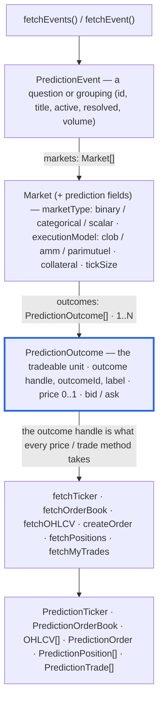

# Prediction Markets

CCXT supports prediction-market exchanges (Polymarket, Kalshi, Limitless, Myriad, and Hyperliquid prediction markets) through a dedicated `prediction` namespace. Prediction exchanges implement the same unified API as regular crypto exchanges, with prices quoted between 0 and 1 USDC per outcome share.

> Per-exchange API references live in the **[Prediction Markets](/docs/prediction)** section, and runnable **[prediction examples](/docs/examples/ts/prediction-markets)** walk through end-to-end trading on each venue.

```javascript tab="JavaScript / TypeScript"
const exchange = new ccxt.prediction.polymarket ()
```

```python tab="Python"
# async-only — ccxt.prediction.<id> IS the async class
import ccxt.prediction
exchange = ccxt.prediction.polymarket()
```

```php tab="PHP"
// async-only, ReactPHP — \ccxt\prediction\<id> IS the async class
$exchange = new \ccxt\prediction\polymarket();
```

```csharp tab="C#"
var exchange = new ccxt.prediction.polymarket();
```

```go tab="Go"
import ccxtprediction "github.com/ccxt/ccxt/go/v4/prediction"
exchange := ccxtprediction.NewPolymarket()
```

```java tab="Java"
import io.github.ccxt.exchanges.prediction.Polymarket;
Polymarket exchange = new Polymarket();
```

Prediction exchanges are flagged with `exchange.has['prediction']`. Their data model has three levels:

- **events** — a question or grouping, like *"Will X happen by July?"*
- **markets** — each event contains one or more markets, returned by `fetchMarkets()` / `loadMarkets()` with `market['type'] === 'prediction'`
- **outcomes** — each market carries an `outcomes` list (for example YES and NO tokens); each outcome has its own `outcome` handle like `TRUMP_OUT_PRESIDENT_2027:YES`, an exchange-specific `outcomeId`, the parent `market`, and a `label` (e.g. `YES`/`NO`)

How the structures relate — `PredictionEvent` → market → `PredictionOutcome`, where the **outcome** is the tradeable unit that every price/trade method takes. Each market is a standard ccxt `Market` row that additionally carries prediction fields (`marketType`, `executionModel`, `collateral`, …) and its own `outcomes` list:



Prices are probabilities between 0 and 1 per share, `amount` is the number of shares, and `cost` is the collateral spent.

## Unified methods

Prediction exchanges expose the same unified API as crypto exchanges. Discovery starts with events; every **price and trade** method then takes an **outcome handle** (or outcome id) through the `outcome` / `outcomes` parameter instead of a market symbol. Support varies per venue — always check `exchange.has[methodName]` and the [per-exchange reference](/docs/prediction/polymarket).

**Discovery & markets**

- `fetchEvents (params?)` — search events (scope by `query`/`queries`/`tags`/`eventId`/`slug`), caching their markets and outcomes
- `fetchEvent (id, params?)` — a single event by id, slug or ticker
- `fetchMarkets (params?)` / `loadMarkets (reload?)` — every market (each carries `type: 'prediction'` and an `outcomes` list)
- `fetchTime (params?)` — exchange server time

**Market data** — each takes an outcome handle

- `fetchTicker (outcome, params?)` / `fetchTickers (outcomes?, params?)` — last price, bid/ask and volume
- `fetchOrderBook (outcome, limit?, params?)` — bids and asks for an outcome
- `fetchOHLCV (outcome, timeframe?, since?, limit?, params?)` — price-history candles
- `fetchTrades (outcome, since?, limit?, params?)` — public trades
- `fetchOpenInterest (outcome, params?)` — open interest
- `fetchTradingFee (outcome, params?)` — taker / maker fees
- `fetchTradeQuote (outcome, ...)` — an executable quote on AMM venues

**Trading** — `amount` is the number of shares, `price` is a probability between 0 and 1

- `createOrder (outcome, type, side, amount, price?, params?)` — place an order
- `createOrders (orders, params?)` — batch create
- `editOrder (id, outcome, ...)` — amend a resting order
- `cancelOrder (id, outcome?, params?)`, `cancelOrders (ids, ...)`, `cancelAllOrders (outcome?, params?)`

**Account & orders**

- `fetchBalance (params?)` — collateral balances
- `fetchOrder (id, outcome?, params?)`, `fetchOrders`, `fetchOpenOrders`, `fetchClosedOrders`, `fetchCanceledOrders`, `fetchOrderTrades`
- `fetchMyTrades (outcome?, since?, limit?, params?)` — your fills
- `fetchPositions (outcomes?, params?)` / `fetchPosition (outcome, params?)` — open positions
- `fetchStatus (params?)` — exchange operational status

**WebSocket (Pro)** — live streams, also keyed by the outcome handle

- `watchTicker`, `watchTickers`, `watchOrderBook`, `watchTrades`, `watchOHLCV`, `watchOrders`, `watchMyTrades`, `watchPositions`

The rest of this page documents `fetchEvents`, `fetchEvent` and `createOrder`; the remaining methods behave like their crypto counterparts in [the Manual](/docs/manual), only addressed by outcome.

## fetchEvents

```javascript
fetchEvents (params = {})
```

- `params` — a `fetchEventsParams` object; **must be scoped** by at least one of `query` (a search string), `queries` (a list of strings), `tags`, `eventId` or `slug` — an unscoped call throws `ArgumentsRequired` on every venue (some venues accept extra scope keys, e.g. Kalshi's `category` / `series_ticker`). Optional: `limit`, `sort` (`volume`/`liquidity`/`newest`), `status` (`active`/`inactive`/`closed`/`all`), `searchIn` (`title`/`description`/`both`). The scope is pushed to the venue's API server-side: `tags` resolve to Kalshi series, Polymarket `tag_slug` listings (one per tag), Limitless categories, and Myriad keyword searches. For an unscoped "most active markets" browse use `fetchMarkets ()` — it returns a capped, volume-ordered listing where the venue supports it
- returns an **array of [event structures](#prediction-event-structure)** and caches the discovered events, markets and outcomes on the instance (`exchange.events`, `exchange.outcomes`)

A typical workflow:

```javascript
const exchange = new ccxt.prediction.polymarket ()
const events = await exchange.fetchEvents ({ 'query': 'Trump' })
const outcome = events[0]['markets'][0]['outcomes'][0]
const ticker = await exchange.fetchTicker (outcome['outcome'])
const orderbook = await exchange.fetchOrderBook (outcome['outcome'])
const candles = await exchange.fetchOHLCV (outcome['outcome'], '1h')
// place a limit buy of 5 YES shares at 0.40 USDC; prices are 0..1 per share
const order = await exchange.createOrder (outcome['outcome'], 'limit', 'buy', 5, 0.40)
```

Outcome-addressed methods (`fetchTicker`, `createOrder`, …) auto-load the outcome cache on first use — like `loadMarkets()` + `market(symbol)` in regular ccxt — so you don't need to `fetchEvents`/`loadMarkets` first. The auto-load is scoped to the requested outcome: a by-id fetch where the venue has one (Kalshi tickers, Polymarket token ids), otherwise a search derived from the handle — never a bulk listing download. A genuinely unknown outcome throws `BadSymbol`. Call `loadOutcomes()` to warm the cache explicitly, or `getEvent(idOrHandle)` to read a cached event.

## fetchEvent

```javascript
fetchEvent (id, params = {})
```

- `id` — the identifier of a single event. Polymarket accepts the numeric event id or its slug, Kalshi the event ticker, Myriad the `networkId:marketId` market id, and Limitless the market slug or address
- returns a single **[event structure](#prediction-event-structure)** (same shape as the entries returned by `fetchEvents`)

```javascript
const exchange = new ccxt.prediction.polymarket ()
const events = await exchange.fetchEvents ({ 'query': 'Trump' })
const event = await exchange.fetchEvent (events[0]['id'])
```

Supported by `polymarket`, `kalshi`, `myriad` and `limitless` (check `exchange.has['fetchEvent']`); Hyperliquid has no single-event endpoint.

## createOrder

```javascript
createOrder (outcome, type, side, amount, price = undefined, params = {})
```

- `outcome` — the outcome handle (e.g. `TRUMP_WINS:YES`) or its raw `outcomeId`, taken from a market's `outcomes` list; it replaces the market symbol used on crypto exchanges
- `type` — `'limit'` or `'market'` (venue support varies — check `exchange.has['createMarketOrder']`)
- `side` — `'buy'` or `'sell'`
- `amount` — the number of shares
- `price` — a probability between 0 and 1 USDC per share; required for `limit`, ignored for `market`
- returns a **[prediction order structure](#prediction-order-structure)** — addressed by outcome instead of symbol
```javascript
const exchange = new ccxt.prediction.polymarket ()
const events = await exchange.fetchEvents ({ 'query': 'Trump' })
const outcome = events[0]['markets'][0]['outcomes'][0]['outcome']
// place a limit buy of 5 YES shares at 0.40 USDC; prices are 0..1 per share
const order = await exchange.createOrder (outcome, 'limit', 'buy', 5, 0.40)
```

Trading needs credentials — each venue's auth (wallet + private key, API keys, …) is documented in the [per-exchange reference](/docs/prediction/polymarket). Batch with `createOrders`, amend with `editOrder`, and cancel with `cancelOrder` / `cancelAllOrders`. See the runnable [prediction examples](/docs/examples/ts/prediction-markets) for full buy → check → cancel flows.

## Prediction structures

Prediction trading structures are **standalone** — they do **not** extend the crypto `Ticker` / `Order` / `Position` / `Trade` / `OrderBook` types, and they have no `symbol`. Identity is the `outcome` handle (`MARKET:LABEL`) plus its raw `outcomeId`. Throughout, `price` is a probability between 0 and 1, `amount` is a number of shares, and `cost` is the collateral spent; `info` always carries the raw venue payload.

### Prediction event structure

```javascript
{
    'info': { ... },                      // the raw exchange response
    'id': '903193',                       // raw exchange event id
    'event': 'US_ELECTION_2024',          // unified event handle (getEvent resolves this)
    'title': 'Will X happen by July?',    // human-readable title
    'description': '...',
    'slug': 'will-x-happen-by-july',      // url slug of the event
    'category': 'Politics',
    'tags': [ 'elections', ... ],
    'markets': [ ... ],                   // grouped ccxt market rows, each with an outcomes list
    'mutuallyExclusive': true,            // exactly one market in the event resolves YES
    'active': true,                       // whether the event is still tradable
    'resolved': false,                    // whether the event has been resolved
    'volume': 1250000,
    'liquidity': 84000,
    'created': 1770000000000,
    'createdDatetime': '2026-02-01T00:00:00Z',
    'end': 1781234567890,                 // resolution deadline timestamp in ms
    'endDatetime': '2026-07-01T00:00:00Z',
    'image': 'https://...',
    'url': 'https://...',
}
```

### Prediction ticker structure

```javascript
{
    'info': { ... },
    'outcome': 'TRUMP_WIN_2024:YES',      // outcome handle — identity (there is no symbol)
    'outcomeId': '123...',                // raw exchange / on-chain outcome id
    'label': 'Yes',                       // short outcome name
    'market': 'TRUMP_WIN_2024',           // parent market handle
    'event': 'US_ELECTION_2024',
    'timestamp': 1710000000000,
    'datetime': '2026-07-01T00:00:00Z',
    'last': 0.62,                         // last traded probability (0..1)
    'bid': 0.61,
    'bidVolume': 1200,                    // shares
    'ask': 0.63,
    'askVolume': 900,
    'high': 0.66,
    'low': 0.58,
    'open': 0.60,
    'close': 0.62,
    'change': 0.02,
    'percentage': 3.33,
    'average': 0.61,
    'baseVolume': 45000,                  // shares traded
    'quoteVolume': 27000,                 // collateral traded
    'openInterest': 15000,
}
```

### Prediction order book structure

```javascript
{
    'outcome': 'TRUMP_WIN_2024:YES',      // required — books are per-outcome
    'outcomeId': '123...',
    'market': 'TRUMP_WIN_2024',
    'bids': [ [ 0.61, 1200 ], ... ],      // [ price (0..1), amount in shares ], best first
    'asks': [ [ 0.63, 900 ], ... ],
    'timestamp': 1710000000000,
    'datetime': '2026-07-01T00:00:00Z',
    'nonce': 123456,
}
```

### Prediction order structure

```javascript
{
    'info': { ... },
    'id': '0xabc...',
    'clientOrderId': '...',
    'outcome': 'TRUMP_WIN_2024:YES',      // identity (there is no symbol)
    'outcomeId': '123...',
    'label': 'Yes',
    'market': 'TRUMP_WIN_2024',
    'event': 'US_ELECTION_2024',
    'timestamp': 1710000000000,
    'datetime': '2026-07-01T00:00:00Z',
    'lastTradeTimestamp': 1710000005000,
    'lastUpdateTimestamp': 1710000005000,
    'status': 'open',                     // 'open' | 'closed' | 'canceled'
    'type': 'limit',
    'timeInForce': 'GTC',
    'side': 'buy',
    'price': 0.40,                        // limit probability (0..1)
    'average': 0.40,                      // average fill probability
    'amount': 5,                          // shares ordered
    'filled': 0,
    'remaining': 5,
    'cost': 0,                            // collateral spent = average * filled
    'reduceOnly': false,
    'postOnly': false,
    'fee': { ... },
    'trades': [ ... ],                    // prediction trade structures
}
```

### Prediction trade structure

```javascript
{
    'info': { ... },
    'id': '...',
    'order': '0xabc...',                  // parent order id
    'outcome': 'TRUMP_WIN_2024:YES',
    'outcomeId': '123...',
    'label': 'Yes',
    'market': 'TRUMP_WIN_2024',
    'timestamp': 1710000005000,
    'datetime': '2026-07-01T00:00:00.000Z',
    'type': 'limit',
    'side': 'buy',
    'takerOrMaker': 'taker',
    'price': 0.40,                        // fill probability (0..1)
    'amount': 5,                          // shares
    'cost': 2.0,                          // collateral = price * amount
    'fee': { ... },
    'realizedPnl': 0,
}
```

### Prediction position structure

```javascript
{
    'info': { ... },
    'id': '...',
    'outcome': 'TRUMP_WIN_2024:YES',
    'outcomeId': '123...',
    'label': 'Yes',
    'market': 'TRUMP_WIN_2024',
    'event': 'US_ELECTION_2024',
    'timestamp': 1710000000000,
    'datetime': '2026-07-01T00:00:00Z',
    'side': 'long',
    'contracts': 10,                      // shares held
    'contractSize': 1,
    'notional': 6.2,                      // position value in collateral
    'entryPrice': 0.55,                   // average entry probability (0..1)
    'markPrice': 0.62,
    'lastPrice': 0.62,
    'unrealizedPnl': 0.7,
    'realizedPnl': 0,
    'percentage': 12.7,
    'collateral': 5.5,
    'resolved': false,                    // has the event resolved?
    'won': false,                         // did this outcome win?
    'settleFraction': undefined,          // 0..1 fractional settlement
    'payout': undefined,                  // claimable collateral after resolution
}
```

The discovery structures — the `PredictionEvent`'s `markets` (ccxt market rows carrying `marketType`, `executionModel`, `collateral`, …) and each market's `outcomes` (`outcome` handle, `outcomeId`, `label`, `price`, `bid`, `ask`) — are described in the [data model](#prediction-markets) above.

## The outcome cache

Prediction exchanges address an **outcome** (e.g. `TRUMP_WINS:YES`, or its raw `outcomeId`) the way regular ccxt addresses a `symbol`. You rarely manage the cache yourself: the first outcome-addressed call (`fetchTicker`, `createOrder`, …) resolves and caches just that outcome — the analogue of `loadMarkets()` + `market(symbol)` — and later calls hit the cache with no extra request. You never need to pre-load; an unknown outcome throws `BadSymbol`.

To warm the cache up front (before a burst of calls), `loadOutcomes (outcomes?)` resolves a list in batched requests, or the whole capped listing when called with no argument; `getEvent (idOrHandle)` reads back an event you already discovered with `fetchEvents`. Everything else about the cache is an implementation detail you can ignore.

> **`fetchTickers` needs an `outcomes` list.** Kalshi, Polymarket, Limitless and Myriad have no "all tickers" endpoint, so a no-arg `fetchTickers ()` throws `ArgumentsRequired` rather than silently returning a capped subset — pass the handles you want. Hyperliquid serves its whole universe in one request, so its no-arg call works.

## CLI

Every language CLI can target a prediction exchange with the `-p` / `--prediction` flag. Regular ids win for ids present in both namespaces (e.g. `hyperliquid`); `-p` forces the prediction namespace, and prediction-only ids (`polymarket`, `kalshi`, `limitless`, `myriad`) resolve there automatically:

```bash
npm run cli.ts -- -p polymarket fetchEvents '{"query":"trump"}'
npm run cli.py -- --prediction kalshi fetchTicker KXBTC-25DEC31-B100000:YES --sandbox
npm run cli.go -- -p hyperliquid fetchBalance
```
